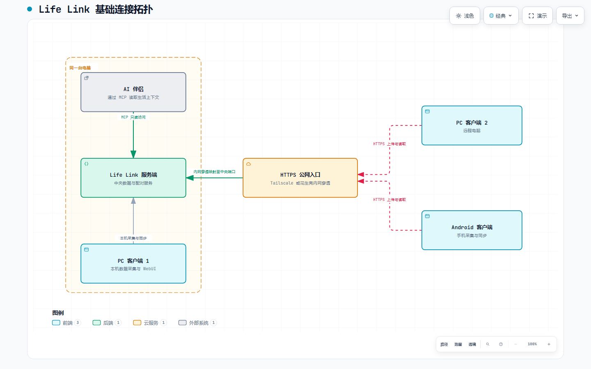
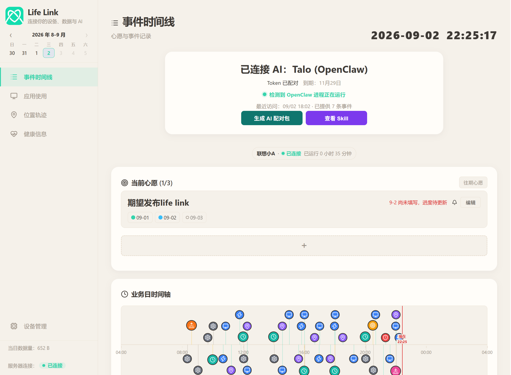
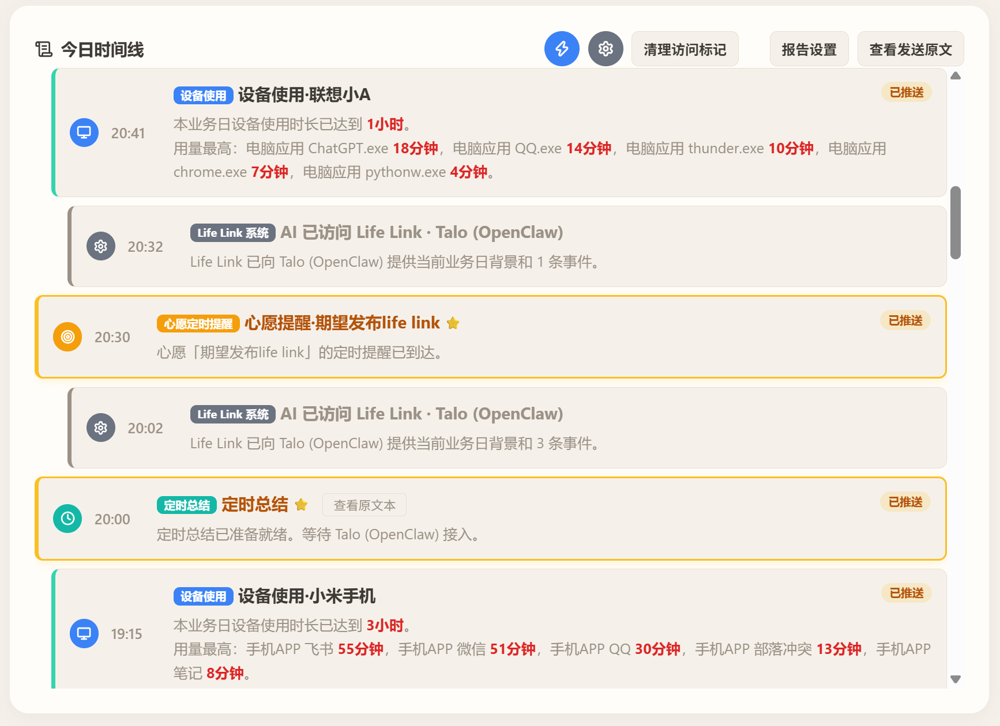
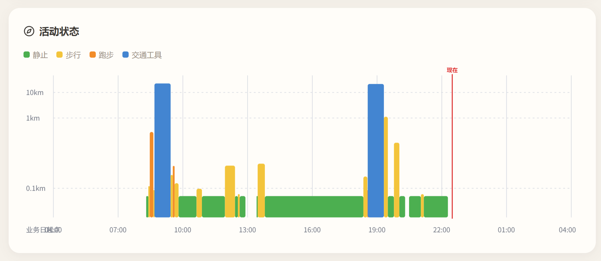
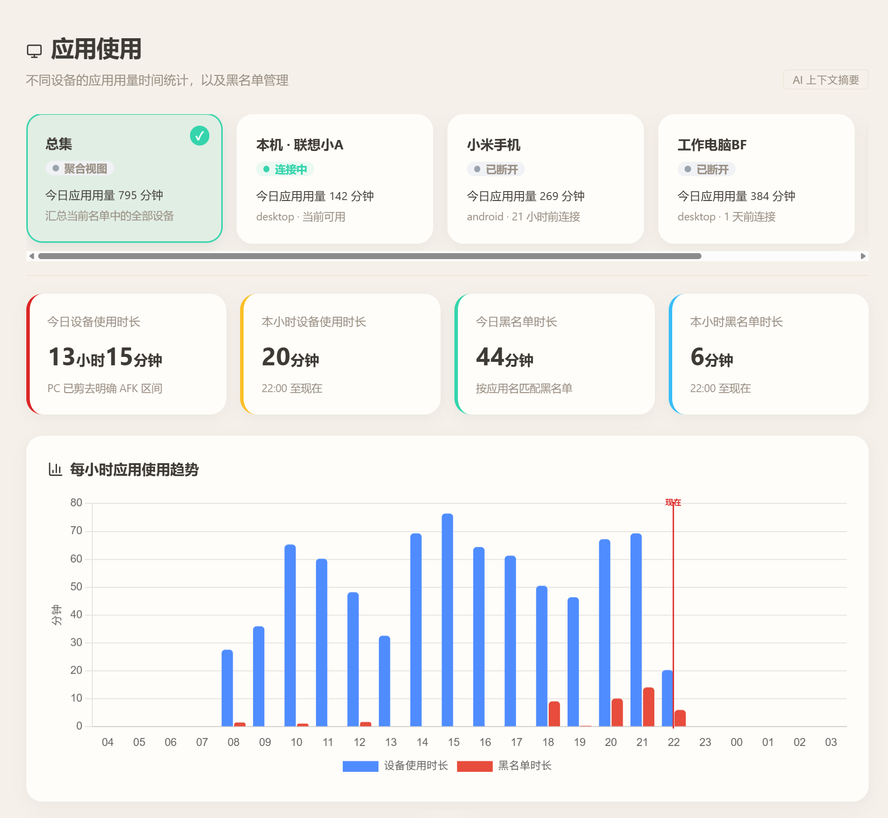

# Life Link

# Personal Context for AI

# 连接你的设备、数据与 AI

1，专门为培养自己的AI伴侣的用户设计。
2，专门为喜欢记录自己生活数据的用户设计。

是否苦恼于AI伴侣不够贴近自己的生活？不够懂你？
Life Link 可以收集：
- **电脑的使用时长**
- **Android 手机的使用时长**
- **地理位置**
- **活动状态**
- **健康信息**
将连续而零散的生活数据整理为AI伴侣能理解的上下文。你不必每次主动介绍自己的近况，AI伴侣也能了解——**你的**真实生活中正在发生什么。

当然，哪怕不接入AI伴侣，本应用也可以作为独立的个人数据面板使用。
先搭建服务，从现在开始收集你的个人信息。准备就绪后，再通过MCP连接你的AI伴侣，完全OK！

## 连接拓扑

AI 伴侣、Life Link 服务端和第一台 PC 客户端可以运行在同一台电脑上。其他电脑上的 PC 客户端和 Android 客户端，都可以通过 Tailscale 或花生壳提供的 HTTPS 入口连接中央服务。

## 能做什么

- **事件时间线**：把高频采集数据转化为值得关注的低频事件，集中呈现心愿、设备使用、报告和提醒。
- **多设备使用统计**：汇总不同电脑和 Android 手机的应用用量，并保留各设备视角。
- **位置与活动状态**：通过手机采集定位和步数，呈现位置轨迹以及静止、步行、跑步和交通工具等状态。
- **心愿与定时报告**：记录短期心愿，生成早报、晚报、定时总结及触发式提醒。
- **面向 AI 的生活上下文**：通过只读身份和 MCP 配对包，让 AI 按需读取背景、当前状态和增量事件。

## 界面预览

### 首页总览

### 事件时间线

设备用量、心愿提醒、报告和 AI 访问会以独立事件汇入当天的时间线。

### 活动状态

按业务日展示由定位与步数综合得到的活动区间。

### 应用使用

在总集和单设备之间切换，查看每日总量、黑名单用量和每小时趋势。

## 快速开始

### 开始前注意

## 最简单部署方案：你如果有 AI，直接交给她，让她帮你部署即可！

- 基础环境：Windows 源码运行支持 Python 3.13 或 3.14；首次运行会直接复用已安装的合格版本，仅在两者都没有时提示安装。
- 服务器：出于保护隐私因素，LifeLink完全需要你自行搭建服务器！建议安装在**长期运行AI伴侣**的个人电脑上。或者，你自己的服务器上。
- 网络连接：有公网服务器时，推荐使用自己的域名、HTTPS 和反向代理正式接入；也可以使用 Tailscale，或花生壳等 HTTPS 内网穿透。三种方式最终都填写一个 HTTPS 地址。
- 不配置服务器远程网络的情况下，不能生成正式 AI MCP 配对包，也不能配对 PC 和 Android 客户端。
- PC端需要同步git项目来安装服务端和PC客户端。
- Android客户端请下载安装配套的打包 APK。

### 0. 下载项目
项目分以下几个部分：
（1）服务端：同步Git仓库到你的电脑或服务器
（2）PC客户端：同步Git仓库到你的电脑
（3）Android客户端：下载 [最新 Android 测试版 APK](https://github.com/Licheng314/LifeLink/releases/latest/download/LifeLink-Android.apk)，安装到你的手机上

### 1. 部署并启动中央服务

#### Windows 平台部署

双击 `central-server/start_server.bat`。
程序会在执行必要的流程后，生成可执行文件，然后启动服务器。
启动成功后会打开只在服务器本机可访问的中央管理页 `http://127.0.0.1:8092`。设备配对、AI 配对和网络设置都在这个页面完成。

- 公网服务器 / 域名：（如果你有服务器，懂公网配置，选这个）
      让域名的 HTTPS 反向代理指向页面显示的中央数据端口，再填写最终域名。
- Tailscale：（如果你想在本机试用，可以下载Tailscale建立连接，但是手机上Tailscale没法和vpn一起使用）
      在中央管理页选择“自动检测 Tailscale”；系统会检查安装与登录状态，并把检测到的 HTTPS 候选地址填入文本框。请自行确认 Serve 转发后，再点击“验证并保存”。
- HTTPS 内网穿透：（如果你想本机使用，更简便的方式是推荐使用花生壳，注册后，在控制台直接找内网穿透。但是这个要花十块钱）
      把内网主机 `127.0.0.1` 和页面显示的中央数据端口填入服务商后台，再粘贴获得的 HTTPS 地址。

新地址只有通过 TLS、Life Link 服务身份和中央实例校验后才会保存；失败不会覆盖原地址。

#### Docker / Linux 部署

参考 [`central-server/README.md`](central-server/README.md#linux--docker服务器部署) 中的 Docker Compose 流程；
它会把数据服务和管理页都限制在服务器本机回环地址。公网只应由 HTTPS 反向代理转发数据服务，不能暴露 8092 管理页、SQLite 文件或 Docker 数据卷。

部署后，请先通过 SSH 隧道在自己的浏览器打开服务器本机的中央 WebUI，再像上面描述那样配置网络域名。具体命令、初始化与备份方式见链接中的 Docker 部署说明。

### 2. 启动 PC 客户端

双击 `pc-dashboard/start_central_client.bat`。

客户端启动器生成后也会登记为开机启动。第一次启动自动打开配对页面；把中央服务给出的**设备配对码**粘贴进去。

以后可以直接使用生成的可执行文件启动项目 `central-server/LifeLink Central Service.exe` 和 `pc-dashboard/LifeLink PC Client.exe`。
中央托盘只保留“打开 WebUI、重启服务器、关闭服务器”三项；需要检查或调整连接时，从托盘打开中央管理页。

### 3. 连接 Android

先下载安装 [最新 Android 测试版 APK](https://github.com/Licheng314/LifeLink/releases/latest/download/LifeLink-Android.apk)。
从中央管理 WebUI 生成设备配对码，再到 Android 应用内输入。连接失败时依次确认手机网络、域名反向代理/Tailscale/内网穿透，以及中央服务是否正在运行。
然后需要根据设置界面引导，逐个启用对应的权限：
（1）手机应用信息：需要启用应用使用采集权限
（2）位置信息：需要启用位置采集权限
（3）步数信息：需要启用健康信息权限
没有权限，就没法收集信息。当然，本项目也绝不会收集多余的信息。（反正信息只会上传到你自己的服务器，而不是我的）

### 4. 连接 AI

先在中央管理 WebUI 验证 HTTPS 地址，再选择“生成 AI 配对包”。浏览器会直接下载 ZIP，不需要 PC 客户端运行。将 ZIP 交给支持 MCP 的 AI；AI 所在机器或容器需自备 Python 3.13 或 3.14，并按包内 README 修改 MCP JSON 中的绝对路径。

### 5. AI主动调用：

出于*架构安全*和*通用性*考虑，本项目目前仅支持**被动等待AI调用**的使用方法。
如希望 AI 定期获得新提醒，请让 AI 自己来定时调用本工具：让它主动使用mcp来检查 Life Link 的更新标记。
具体的使用方法可以查看Skill说明。或者让你的AI伴侣阅读之后向你讲解哦！

### 数据位置

同一 Windows 用户的 Life Link 身份、配置和数据库统一保存在用户目录下 `%USERPROFILE%\LifeLink`，不随项目安装位置变化。里面会存储你的私密信息，注意保护个人信息安全！
